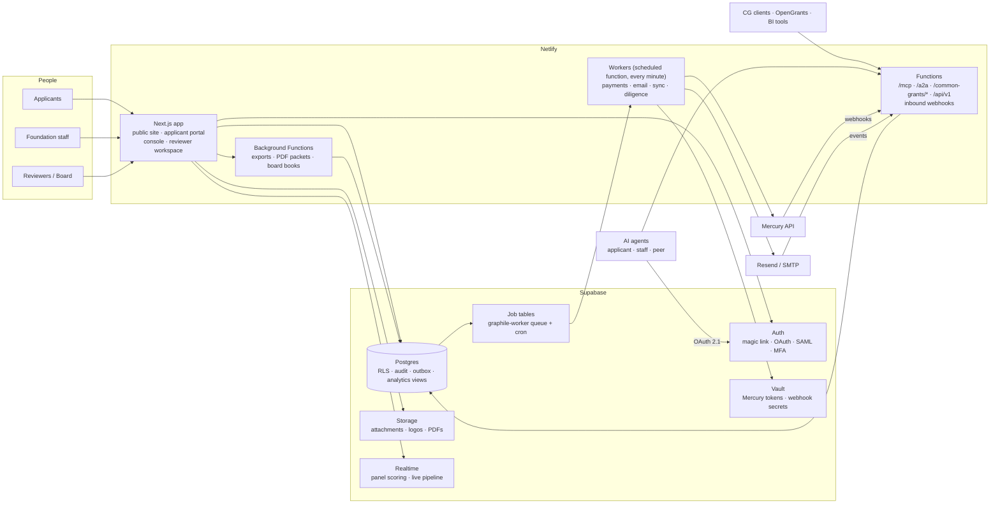
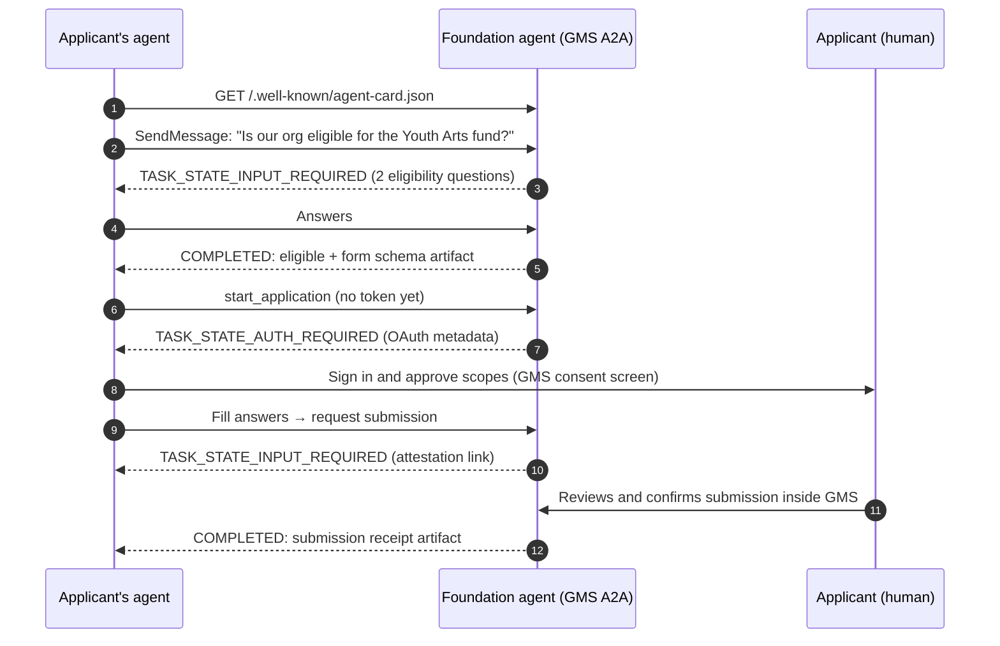

# Open-Source Grants Management Platform: Interfaces & Architecture Outline

**Version:** 0.4 · **Date:** September 27, 2026 (v0.4: server-side data access via Kysely with per-transaction RLS claims; background jobs via graphile-worker on Netlify, replacing Supabase Queues and Edge Functions)
**Project:** GMS · **Repo:** `github.com/egeria-corporation/gms` · **License:** AGPL-3.0 · **Hosted:** full feature parity with open source
**Stack:** Supabase (Postgres, Auth, Storage, Vault, Realtime) + Netlify (hosting, Functions, Scheduled and Background Functions) + graphile-worker (Postgres-backed jobs)
**Standards:** CommonGrants protocol (HHS/simpler-grants-protocol) · JSON Forms · Mercury API · MCP (spec 2026-07-28) · A2A 1.0 · OAuth 2.1

---

## 0. Summary

- **What it is:** a grants management system for grantmakers. Staff design and publish funding opportunities, applicants apply through a branded portal, reviewers score, staff decide and award, grants are paid through the foundation's own Mercury account, and staff get reporting on the whole portfolio.
- **Built on CommonGrants from day one:** the internal data model extends the CommonGrants (CG) models: Opportunity, Competition, Form, Application, Award, Organization. The `/common-grants/*` API ships in v1 with the required routes and adds the apply, awards, and orgs routes over later phases.
- **Forms are portable data, not code:** every form is a JSON Schema plus a UI Schema rendered with JSON Forms. CommonGrants chose the same framework for its form library (ADR-0020), so our forms can import from the CG form library and question bank, prefill from CG data, and be exported unchanged.
- **The foundation's bank moves the money; the platform only sends instructions and keeps the record.** Mercury is the main payment rail. By default the platform uses Mercury's **request-send-money** approval flow, which gives dual control, needs no static IP, and supports international wires. Grantees enter their own bank details through **Mercury recipient invites**, so the platform never stores account numbers.
- **One codebase, two ways to deploy:** self-hosted with one tenant (Deploy to Netlify + a Supabase project), or the hosted multi-tenant service (pooled Postgres with RLS, a subdomain or custom domain per foundation). Foundations brand their instance (name, logo, colors), but it is not white-label: a small "Powered by GMS" footer stays on.
- **Agents can use GMS the way people do (§12).** Applicants' agents, foundations' agents, and other organizations' agents can all work with GMS through an MCP server, an A2A agent for each foundation, OAuth 2.1 login on a person's behalf, and published agent guides (`/llms.txt`, `/agents.md`). Every action is defined once and offered to both people and agents, with the same permissions. Agents can draft and propose; only people can approve payments, make final decisions, or sign attestations.
- **Open source under AGPL-3.0, and the hosted service has every feature.** Nothing is held back from the public repo. Egeria sells the hosted service for running it: operations, the network across funders, and support.

---

## 1. Design principles

1. **Never hold funds.** The foundation's bank account executes every payment. The platform prepares, approves, instructs, tracks, and reconciles.
2. **Protocol first.** CommonGrants models are the external contract. Anything extra goes into `customFields` and is published as a CG plugin, never as a fork of the schema.
3. **Applicant effort is the product.** Applicants fill in their profile once and it prefills every form. Every page autosaves. Collaboration is built in.
4. **Postgres enforces authorization.** Row Level Security on every table. Application code is never the only barrier.
5. **Money and decisions are auditable.** An append-only audit log, maker-checker approvals, and idempotent payment instructions.
6. **Self-hosting must stay easy.** Target: under 30 minutes from repo to a running instance for a non-engineer operations lead, with a guided setup wizard.
7. **Accessible by default.** WCAG 2.2 AA on every applicant- and reviewer-facing surface.
8. **Agents are full users, and people approve anything consequential.** Anything a person can do in the UI, an agent with the same role and scopes can do through MCP, A2A, or the API. Money, final decisions, and legal attestations always need a person to confirm inside GMS.

---

## 2. Actors & roles

| Side | Role | Can do |
|---|---|---|
| Grantmaker | **Owner / Admin** | Everything, including branding, integrations, roles, and billing (hosted) |
| Grantmaker | **Program Officer** | Programs, opportunities, forms, applications, review setup, award recommendations |
| Grantmaker | **Finance** | Payment schedules, batches, approvals, reconciliation, Mercury connection |
| Grantmaker | **Internal Reviewer** | Score assigned applications |
| Grantmaker | **Board / Committee Member** | View dockets and record votes (time-boxed access) |
| Grantmaker | **Auditor (read-only)** | Read everything, including the audit log. Write nothing. |
| External | **Panel Reviewer** | Only assigned applications, after declaring any conflict of interest (COI) |
| Applicant | **Org Admin** | Org profile, all of the org's applications, payee setup, reports |
| Applicant | **Collaborator** | Edit the applications they're invited to |
| Applicant | **Individual Applicant** | Fellowships and scholarships (no org) |
| Platform | **Operator / Support** (multi-tenant mode) | Tenant provisioning, support access (consented and audited) |
| Machine | **API client / CG client** | Scoped API keys or OAuth |
| Agent | **Delegated agent** (an applicant's or staff member's AI assistant) | Whatever its person can do, limited to the scopes that person approved. Consequential actions come back to that person to confirm. |
| Agent | **Foundation agent account** (autonomous, owned by a named staff member) | Only the tools and scopes it's been allowlisted for. Can be paused at any time. |
| Agent | **Peer agent** (another organization, via A2A) | Only the public skills, plus any skills the partner agreement allows |
| Machine | **Mercury, email provider** | Inbound webhooks |

Payment approval permissions are held apart from program permissions. Nobody can both create and approve the same payment.

---

## 3. Interface inventory

### 3.1 Human interfaces (surfaces)

| # | Surface | Primary users | Rendering | Branded? |
|---|---|---|---|---|
| A | **Public Funding Site** | Public, prospective applicants | SSR/SSG (SEO) | Yes |
| B | **Applicant Portal** | Applicant orgs & individuals | SSR + client | Yes |
| C | **Grantmaker Console** | Foundation staff | App shell (client-heavy) | Foundation logo in platform chrome |
| D | **Reviewer Workspace** | Internal and panel reviewers | Client | Yes |
| E | **Board / Committee Docket** | Board members | SSR + PDF | Yes |
| F | **Setup Wizard** | First admin (self-host and new hosted tenants) | Client | n/a |
| G | **Platform Operator Console** | Anyone running multi-tenant mode (Egeria's hosted service included) | Client | No (separate app) |
| H | **Branded outputs** | Everyone | Email, PDF, .ics | Yes |

#### A. Public Funding Site
- Foundation landing page: about, open and forecasted opportunities, contact.
- Opportunity listing with filters (status, program, amount, deadline, applicant type).
- Opportunity detail: summary, eligibility, funding range, key dates, FAQs, downloadable guidelines, **Start application**.
- **Eligibility pre-check:** a short quiz with no account needed. Hard knock-outs end it with a friendly message.
- **Awarded grants page** (optional transparency). Same data as the CG `/awards` feed.
- **Embed widget:** a web component or iframe that lists open opportunities on the foundation's existing website.
- SEO: schema.org markup, sitemap, Open Graph images generated from the brand settings.

#### B. Applicant Portal
- **Sign-in:** magic link (default), Google, or Microsoft, with optional MFA.
- **Organization profile** (reused across applications): legal name, EIN (with an IRS status lookup), optional UEI, addresses, mission, budget size, contacts, and a **document vault** (990s, audit, W-9, board list, determination letter).
- **My applications:** status tracker, deadlines, open tasks, messages.
- **Application workspace:** multi-page form with a progress bar; autosave; save and return; invite collaborators; internal team comments; attachments; a validation summary; preview and PDF; submit with an attestation; a receipt by email.
- **Messages:** a threaded conversation with foundation staff for each application.
- **Post-award:**
  - Accept the award letter and e-sign the agreement.
  - **Payment setup** (Mercury onboarding link).
  - Payment history and remittance advice.
  - Report requests and submissions.
  - Extension, amendment, and budget-modification requests.
- **Account:** notification preferences, data export and delete requests.
- **Connected agents:** which AI agents can act for you, their scopes, a log of what each did, and pending confirmations (for example, "your agent wants to submit this application"). Revoke any agent with one click.

#### C. Grantmaker Console (staff app), by module
- **C1 Home:** my tasks, upcoming deadlines, pipeline snapshot, payments awaiting approval, overdue reports.
- **C2 Programs & Budgets:** programs/funds, fiscal-year budgets, the taxonomy (cause area, geography, population served), and which Mercury account each program pays from.
- **C3 Opportunity Studio (design & deploy):**
  - Opportunity editor. Its fields map to the CG Opportunity model.
  - Competitions (application rounds or stages) with dates and forms.
  - **Form Builder** (§7).
  - Eligibility rules.
  - Publish lifecycle: draft → forecasted → open → closed → archived. Supports scheduling, invite-only links, and preview as an applicant.
- **C4 Applications Pipeline:** table and kanban views, saved filters, bulk actions (advance, decline, assign, message), duplicate detection, eligibility screening results, and a full application view with its activity timeline.
- **C5 Review Management:**
  - Review stages.
  - **Rubric builder:** criteria, weights, scales, guidance.
  - Reviewer pool.
  - Assignment: auto round-robin with load balancing, or manual.
  - COI rules; blind-review field masking.
  - Progress tracking; score normalization and calibration views.
  - Panel meeting mode, with live score aggregation via Realtime.
- **C6 Decisions & Awards:**
  - Recommendations and dockets.
  - Decision recording: approve, decline, or defer, with reasons.
  - Award builder: amount, period, conditions, **payment schedule**.
  - Award letters and agreements (templates plus e-sign).
  - Amendments and supplements (CG `parent` award).
  - Decline letters.
- **C7 Payments:**
  - Payee status (onboarded, pending, expired).
  - Installments due.
  - **Batch builder**.
  - In-app approvals (maker-checker, amount thresholds, MFA step-up).
  - Mercury submission status.
  - Available balance per account.
  - Reconciliation exceptions.
  - Payment holds (for example, an overdue report).
- **C8 Grantee CRM:** organizations and people; relationship timeline (applications, awards, payments, reports, messages); notes; due-diligence status; tags.
- **C9 Post-award & Compliance:**
  - Report requirements, generated from award templates.
  - Report forms, built with the same builder.
  - Review and acceptance of reports.
  - Outcome indicators.
  - Site-visit notes.
  - Due-diligence checks (IRS status, OFAC).
  - Expenditure-responsibility flags.
- **C10 Analytics & Reports** (§10).
- **C11 Communications:** email templates with merge fields, bulk messages to segments, automated notification rules (deadline reminders, report due), and delivery/bounce status.
- **C12 Settings:**
  - **Branding** (§9).
  - Team & roles.
  - **Integrations:** Mercury, email domain, SSO, OpenGrants syndication.
  - Custom fields & taxonomies.
  - API keys and outbound webhooks.
  - **Agents:**
    - agent accounts (owner, scopes, tool allowlist, rate limit, pause);
    - connected third-party agents;
    - the **AI-use policy** (whether AI-assisted applications are allowed, allowed with disclosure, or not allowed; whether reviewer assist is on);
    - the Agent Card and agent-guide preview;
    - an optional built-in agent model key.
  - **Approval inbox:** actions agents have proposed, waiting for a person to confirm (also surfaced on C1 Home).
  - Data export.
  - **Audit log** viewer, filterable by human, agent, or system.

#### D. Reviewer Workspace
- An assignment queue with due dates. A COI declaration is required before the reviewer can open any content.
- Split view: the application on one side, the rubric on the other. Criterion guidance inline; score and comment for each criterion; private and panel-visible notes.
- Save draft, submit, and request recusal. Blind mode hides identity fields that are flagged on the form.

#### E. Board / Committee Docket
- An auto-generated board book: summaries, review scores, recommended amounts, and budget impact by program.
- Record votes (approve, decline, defer) with the voter and a timestamp. Export to PDF. Board access is read-only and expires.

#### F. Setup Wizard (first run)
Create the owner → brand the instance → connect email → connect Mercury (optional) → create the first program and opportunity from a template → invite the team.

#### G. Platform Operator Console (multi-tenant mode)
Tenant provisioning, plans and billing (Stripe), usage metering, feature flags, support access (the tenant must consent, the session is time-boxed, and all of it is audited), migration status, health, and abuse monitoring.
This console ships in the open-source repo too. Anyone can run multi-tenant mode, for example a community foundation hosting GMS for its affiliate funds.

#### H. Branded outputs
- **Transactional emails:** invites, receipts, status changes, reminders, payment-sent notices.
- **PDFs:** application packet, award letter, agreement, remittance advice, board book.
- **.ics calendar files** for deadlines.

### 3.2 Machine interfaces (APIs & integrations)

| Interface | Direction | Auth | Purpose |
|---|---|---|---|
| **CommonGrants API** `/common-grants/*` | Inbound | Public for opportunities; API key/OAuth for the rest | Standard grant data exchange (§6) |
| **Platform REST API** `/api/v1/*` | Inbound | Workspace-scoped API keys; OpenAPI documented | Full automation surface beyond CG (programs, reviews, payments read, reports) |
| **Server-side data access** (Kysely over Postgres) | Internal | Verified user JWT claims set per transaction, so RLS applies | Console and portal data access; the browser uses Supabase only for auth, uploads, and realtime |
| **Outbound webhooks** | Outbound | HMAC-signed, retried, delivery log | `application.submitted`, `award.created`, `payment.sent`, and others |
| **Mercury API** | Outbound | API token (self-host) or OAuth2 (hosted) | Recipients, invites, payments, transactions, balances (§8) |
| **Mercury webhooks** | Inbound | Signing secret | Payment status and balance events |
| **Email** (Resend adapter by default; SMTP adapter) | Out + inbound events | API key | Transactional and bulk email; bounce and complaint webhooks |
| **E-signature** adapter | Out + inbound | Provider auth | v1: built-in click-to-sign with an audit trail. Later: Documenso (OSS) or DocuSign adapters |
| **Due-diligence data** | Outbound / batch import | n/a | IRS Exempt Organizations BMF / Pub 78 bulk data (free), OFAC SDN list (free), optional Candid API |
| **Identity providers** | Outbound | OAuth/SAML | Google and Microsoft sign-in; SAML SSO for staff |
| **OpenGrants syndication** (optional) | Outbound | API key | Push open opportunities into OpenGrants discovery; the CG feed also makes them crawlable by any CG aggregator |
| **Other CG clients** | Inbound | OAuth | For example, consultant portals that read application or award status for their clients |
| **BI access** | Inbound | Read-only DB role | Metabase, Evidence, and similar tools on the `analytics` schema |
| **MCP server** `/mcp` | Inbound | OAuth 2.1 (delegated) or agent-account key | Tools for applicant agents and staff agents (§12.3) |
| **A2A agent** `/a2a` + `/.well-known/agent-card.json` | Inbound + outbound | OAuth 2.1 / API key / mTLS, as the Agent Card declares | Each foundation's own intake agent; peer-agent coordination (§12.3) |
| **Agent discovery & guides** | Inbound | Public | `/llms.txt`, `/agents.md`, OAuth metadata, markdown versions of public pages (§12.5) |

---

## 4. Platform architecture

### 4.1 System context



### 4.2 Stack choices

| Layer | Choice | Why |
|---|---|---|
| Language | TypeScript end to end | CG publishes a TS SDK with Zod schemas; one language for contributors |
| Web framework | **Next.js (App Router)** | SSR for public SEO pages; first-class Netlify support; the largest OSS contributor pool. Alternative: React Router v7 |
| UI kit | Tailwind + shadcn/ui (Radix primitives) | Accessible primitives; design tokens map directly onto brand CSS variables |
| Form runtime | **JSON Forms** (`@jsonforms/react`) + a custom renderer set | Matches the CG form-library decision; schema, UI schema, and renderer are decoupled |
| Validation | Ajv (JSON Schema) on the server; Zod for API contracts | The same schema validates in the browser and on the server |
| Database | Supabase Postgres; SQL migrations (Supabase CLI) as the source of truth; Kysely with generated types for server-side queries, with RLS applied by setting the verified JWT claims per transaction | Real transactions for multi-step operations; RLS still enforced; also runs on plain Postgres for self-hosters and tests |
| Auth | Supabase Auth | Magic link, OAuth, SAML SSO, MFA, a custom access-token hook for role claims, and an **OAuth 2.1 server** for agent login and the CG `/orgs` routes. It supports dynamic client registration and puts the `client_id` claim in tokens, where RLS can use it. |
| Capability layer | `packages/actions`: a typed action registry (Zod) | One definition generates REST, MCP tools, A2A skills, and UI server actions (§12.2) |
| Agent protocols | MCP TypeScript SDK (spec 2026-07-28, stateless streamable HTTP); an A2A 1.0 SDK or a thin JSON-RPC binding | The stateless MCP spec runs cleanly on serverless functions; no session storage needed |
| Files | Supabase Storage with RLS on `storage.objects` and short-lived signed URLs | Per-workspace and per-application isolation |
| Jobs | graphile-worker (Postgres-backed queue + cron). A Netlify Scheduled Function runs `runOnce()` every minute; Netlify Background Functions (15-minute limit) handle heavy work; `pnpm worker` runs locally | Queue state lives in Postgres, so jobs are transactional with the data; one Node runtime for all TypeScript |
| Email | React Email templates; Resend adapter by default; SMTP adapter | Self-hosters can bring any SMTP provider |
| PDF | `@react-pdf/renderer` in background functions | Branded, deterministic documents |
| Testing | Vitest, Playwright, **pgTAP for RLS policy tests** | Every role × table access is tested |
| Repo | pnpm + Turborepo monorepo | Shared packages across the app and SDKs |
| Observability | Sentry, Supabase logs, Netlify logs | OSS-friendly defaults |

### 4.3 Monorepo layout

```
egeria-corporation/gms          AGPL-3.0 (LICENSE at root, SPDX headers in source files)
AGENTS.md              Instructions for coding agents contributing to GMS (build, test, RLS rules, migrations)
/apps
  /web                 Next.js: public site, applicant portal, console, reviewer, docket
  /docs                Docs site (self-hosting, API, contributor guide)
  /operator            Multi-tenant operator console (open source; separate deploy)
/packages
  /actions             Capability registry: every operation's schema, scope, risk tier, approval rule, audit label
  /mcp                 MCP server adapter (tool sets for applicant and staff) generated from /actions
  /a2a                 A2A adapter: Agent Card builder, skills, task store, push notifications
  /agent-evals         Scripted agent scenarios run against the sandbox in CI
  /db                  SQL types, query helpers, RLS test fixtures
  /commongrants        CG adapters: internal <-> CG mappers, TypeSpec extensions, plugin definition
  /forms               JSON Forms renderer set, builder components, question bank, Ajv setup
  /payments            PaymentRail interface + mercury + manual rails
  /ui                  shadcn-based design system + theming engine
  /email               React Email templates + provider adapters
  /pdf                 Document templates (award letter, packet, remittance, board book)
  /config              Shared ESLint/TS/Tailwind config
/apps/worker           graphile-worker tasks (payments, notify, sync, diligence, reconcile) + cron
/supabase
  /migrations          Versioned schema (source of truth)
  seed.sql             Demo foundation, programs, forms, applications
/compat                Supabase shim so migrations and RLS tests also run on plain Postgres
(RLS matrix + constraint tests run in Vitest against a real Postgres)
/spec
  main.tsp             TypeSpec extending @common-grants/core -> OpenAPI
/netlify.toml          Build, functions, redirects, headers
```

### 4.4 What runs where

| Concern | Runs on | Notes |
|---|---|---|
| Pages (public, portal, console) | Netlify (Next.js SSR/RSC) | Middleware resolves the tenant from the hostname |
| `/common-grants/*`, `/api/v1/*` | Netlify Functions (Next.js route handlers) | Stateless; read through RLS-scoped or service clients |
| `/mcp`, `/a2a`, agent discovery files | Netlify Functions | Stateless MCP (2026-07-28). A2A tasks and MCP Tasks are persisted in Postgres (`agent_tasks`), so any function instance can serve them. |
| Inbound webhooks (Mercury, email) | Netlify Functions | Verify signature → store the raw event → enqueue → return 200 quickly |
| Domain logic & integrity | Postgres | Constraints, state-transition functions, audit triggers, **transactional outbox** |
| Async workers | graphile-worker tasks, run by a Netlify Scheduled Function (`runOnce()` every minute; 30s limit) and by Background Functions for long jobs | Payment submit, status sync, reconciliation, notifications, reminders, diligence refresh. Keep scheduled batches small. |
| Heavy jobs | Netlify Background Functions | Up to 15 minutes: CSV/XLSX exports, PDF packets, board books |
| Secrets | Supabase Vault | Mercury tokens and webhook secrets; never sent to the browser |
| Live collaboration | Supabase Realtime | Panel scoring, pipeline updates, co-editing presence |

**Event pattern:** every state change writes an `outbox` row in the same transaction. The worker picks it up from the job queue. Idempotent workers fan it out to notifications, outbound webhooks, analytics refresh, and payment actions. Core domain events:

`opportunity.published` · `application.started` · `application.submitted` · `application.status_changed` · `review.assigned` · `review.submitted` · `decision.recorded` · `award.created` · `award.amended` · `payee.onboarded` · `payment.requested` · `payment.approved` · `payment.sent` · `payment.failed` · `report.due` · `report.submitted`

### 4.5 Tenancy model

- **Workspace = one grantmaker.** Every grantmaker-owned row carries `workspace_id`. RLS policies call helpers such as `has_role(workspace_id, 'finance')`, backed by JWT claims from the Supabase custom access-token hook.
- **The applicant commons is global.** Users and applicant organizations are not owned by any workspace. The applicant owns the profile. On submit, a **snapshot** is copied into the workspace's application record, so the foundation's record never changes afterwards and the applicant can keep editing the live profile.
  - In the hosted service this enables **one applicant profile across every funder on the platform**, a network effect that grows with each foundation.
  - Self-hosted, the commons holds only that foundation's applicants.
- **Self-hosted:** one workspace by default. It runs the same code, schema, and RLS policies as the hosted service, and self-hosters can switch on multi-tenant mode with the same config flag the hosted service uses.
- **Hosted, pooled (default):** one Supabase project per environment with RLS isolation, and one Netlify site with wildcard subdomains (`{slug}.<hosted-domain>`) plus optional custom domains (e.g., `grants.examplefoundation.org`).
- **Hosted, siloed (enterprise option):** a dedicated Supabase project plus a Netlify site for regulated or large foundations. Same release, driven by config.
- **Environments:** dev, staging, and prod, with Supabase branching for preview deploys.

---

## 5. Core data model (with CommonGrants mapping)

| Domain | Key tables | CG model |
|---|---|---|
| Tenancy & identity | `workspaces`, `workspace_members`, `role_grants`, `invitations`, `api_keys`, `workspace_brand` | none |
| Applicant commons | `profiles`, `applicant_orgs`, `applicant_org_members`, `org_identifiers`, `org_addresses`, `org_documents` | **Organization** (`OrgIds`: `org:us:ein`, `org:us:uei`), Person |
| Programs | `programs`, `program_budgets`, `fiscal_years`, `taxonomy_terms` (cause/PCS, geography, population) | `customFields` on Opportunity |
| Opportunities | `opportunities`, `competitions`, `competition_forms`, `competition_invites` | **Opportunity**, **Competition** |
| Forms | `forms`, `form_versions`, `question_bank_items`, `form_templates` | **Form** (`jsonSchema`, `uiSchema`, `mappingToCommonGrants`, `mappingFromCommonGrants`) |
| Applications | `applications`, `application_submissions` (immutable snapshot), `form_responses`, `attachments`, `application_collaborators`, `eligibility_results`, `status_history` | **Application**, **AppFormResponse** |
| Review | `review_stages`, `rubrics`, `rubric_criteria`, `review_assignments`, `reviews`, `review_scores`, `coi_declarations`, `panels` | Internal (status is exposed through the application) |
| Decisions & awards | `decisions`, `dockets`, `votes`, `awards`, `award_conditions`, `agreements`, `signatures` | **Award** (`AwdFunding`, `AwdTimeline`, `parent` for amendments/tranches) |
| Payments | `bank_connections`, `bank_accounts`, `payees`, `payment_schedules`, `installments`, `payment_batches`, `payments`, `payment_approvals`, `rail_events`, `bank_transactions`, `recon_exceptions` | Feeds `AwdFunding.disbursedAmount` |
| Post-award | `report_requirements`, `report_submissions`, `indicators`, `indicator_values`, `site_visits` | `customFields` |
| Comms | `threads`, `messages`, `notifications`, `email_templates`, `email_events` | none |
| Compliance & platform | `diligence_checks`, `sanctions_screenings`, `audit_log`, `outbox`, `webhook_endpoints`, `webhook_deliveries`, `exports` | none |
| Agents | `agent_clients` (OAuth clients and agent accounts, with owner, scopes, tool allowlist, status), `agent_grants` (a person's consent to an agent), `agent_tasks` (A2A/MCP task state), `approval_requests` (agent-proposed actions awaiting a person), `agent_policies` (the foundation's AI-use settings) | Application `customFields` (AI-assistance disclosure) |

**Conventions**
- Money is stored as integer minor units plus an ISO currency code. The CG adapter converts to the CG `Money` type at the edge.
- UUID primary keys everywhere (CG requires UUID ids). Every table has `created_at` and `last_modified_at` (these map to CG `createdAt` / `lastModifiedAt`).
- Status: rich internal state machines, mapped to the CG enums. Values with no CG equivalent use `custom` plus `customValue`.

| Internal application state | CG `AppStatus` |
|---|---|
| draft | `inProgress` |
| submitted | `submitted` |
| screening / in_review / invited_next_stage | `custom` (`underReview`, `invitedToNextStage`) |
| approved / awarded | `accepted` |
| declined / ineligible | `rejected` |
| withdrawn | `custom` (`withdrawn`) |

---

## 6. CommonGrants adoption plan

**Version target.** Pin `@common-grants/core` **0.4.x**. Per its changelog, 0.2.0 added Competition, Form, and Application with the apply routes; 0.3.0 added application review routes (`POST /applications/search`); 0.4.0 added the Award model and routes, identifier models (EIN/UEI), and the OAuth-protected `/orgs` profile-sync routes. Some pages on commongrants.org still carry older version labels, so treat the TypeSpec package and its changelog as the source of truth.

**Route roadmap** (all under the `/common-grants/` prefix, which the spec requires)

| Route | Spec status | Our phase | Why it matters |
|---|---|---|---|
| `GET /opportunities` (paginated, sorted by `lastModifiedAt`) | **Required** | 1 | Compliance; any CG aggregator can index our opportunities |
| `GET /opportunities/{oppId}` | **Required** | 1 | Compliance |
| `POST /opportunities/search` | Optional | 1 | Filtered discovery (status, dates, money) |
| `GET /forms`, `GET /forms/{formId}` | Experimental | 2 | Form portability |
| Competition routes | Experimental | 2 | Rounds and stages exposed to other platforms |
| `POST /applications/start`, `GET /applications/{appId}`, `GET\|PUT /applications/{appId}/forms/{formId}`, `PUT /applications/{appId}/submit` | Experimental | 2–3 | **Apply from other platforms** (OpenGrants, consultant portals) |
| `POST /applications/search` | Added 0.3.0 | 2 | Status sync for partners and consultants |
| `GET /awards`, `POST /awards/search`, `GET /awards/{awdId}` | Added 0.4.0 | 2 | Public transparency feed; portfolio data sharing |
| `/orgs` routes (OAuth 2.0; `PATCH /orgs/{orgId}` with JSON Merge Patch; `POST /orgs/{orgId}/changes`) | Added 0.4.0 | 3 | Applicants import and sync their profile from other CG platforms |

**Implementation**
- `spec/main.tsp` extends `@common-grants/core`. The CG CLI (`cg compile`) generates our OpenAPI, and CI runs contract tests: response shape, pagination (`page`, `pageSize`, `paginationInfo`), and round-trips (internal → CG → internal).
- Extensions (program, cause area, geography, grant type, payment schedule) go in `customFields`. We package them as a **CG plugin** (`definePlugin`) so other implementers can read our extra fields.
- Forms are stored in the CG `FormBase` shape, so the CG form library (SF-424 variants, Form A/B, Key Contact) and **question bank** items import directly. The `mappingToCommonGrants` / `mappingFromCommonGrants` fields drive prefill.
- Organization identifiers use the CG registry keys (`org:us:ein`, `org:us:uei`). Awards use `systemId` plus our reference number.

---

## 7. Form design, deployment & management

### 7.1 Object model
**Question-bank item** → **Form** (versioned JSON Schema + UI Schema) → attached to a **Competition** (a round or stage with dates and access rules) → under an **Opportunity** (the public listing).
A multi-stage process (LOI → invited full proposal) is a sequence of competitions. Stage 2 and later are invite-only.

### 7.2 Builder (Opportunity Studio → Form Builder)
- A drag-and-drop canvas with pages, sections, and fields, plus a live preview (desktop and mobile) that shows the real applicant renderer.
- **Field palette**
  - **Basic:** short and long text, rich text, number, currency, date, select, multi-select, checkbox, yes/no.
  - **CG field types:** Name, Address, Email, Phone, Money, EIN, UEI. Each has built-in validation and a CG mapping.
  - **Advanced:** file upload (type and size rules); **repeater/table** (budget line items, key staff) with computed totals; matrix/Likert; attestation/signature; an info block (read-only guidance).
- **Logic**
  - JSON Forms rules (SHOW, HIDE, ENABLE, DISABLE) for conditional display.
  - JSON Schema `if/then/else` for conditional requirements.
  - Knock-out **eligibility rules**, reusable in the public pre-check.
- **Limits and help:** word and character limits, per-field help text, reviewer-only notes, and a **blind-review flag** on identity fields.
- **Question bank:** search CG bank items and the foundation's own saved questions, then insert them already mapped.
- **Templates:** general operating, project, capacity building, fellowship/individual, scholarship, and the grantee report forms. The CG form library can be imported.
- **Checks before publishing:** a validation linter (unmapped required fields, missing labels, accessibility issues), a test-submission mode, and a diff against the previous version.

### 7.3 Versioning & publishing rules
- A published form version is **immutable**. Editing a form in an open competition creates a new version.
- Migrating in-progress responses: answers carry over by field key; answers to removed fields are flagged to the applicant; newly required fields show up as validation errors.
- Every submission records the exact form version it was submitted against.

### 7.4 Deployment controls
- Lifecycle states: draft → forecasted → open → closed. Opening and closing can be scheduled in the foundation's timezone.
- Deadline options: hard deadline, grace window, per-applicant extensions, and a submission cap.
- Access: public, invite-only (tokenized links), or restricted by applicant type.
- Distribution: public site, embed widget, CG feed, and optional OpenGrants syndication.

### 7.5 Applicant experience requirements
Autosave on every field change; save and return; progress by page; collaborators with roles; attachment reuse from the document vault; **prefill from the org profile** through the CG mappings; "copy from my previous application"; mobile-first; WCAG 2.2 AA; i18n-ready (Spanish first); PDF of the submission; an emailed receipt with a timestamp. Ajv validates on the server at every save and again at submit.

### 7.6 Optional AI assist (later phase, human-approved)
- Convert an existing PDF or Word application into a draft form.
- Rewrite instructions in plain language.
- Accessibility and readability lint.
- Summarize applications for reviewers. Clearly labeled, and turned off by default.

---

## 8. Mercury banking integration

### 8.1 Mercury capabilities we use

| Capability | Mercury API | Used for |
|---|---|---|
| Accounts & balances | `GET` accounts; balance webhooks | Pick the source account per program; check the balance before a batch |
| **Recipient invites** | Create/get/list invites (`paymentMethods`, `requireTaxDocument`, `onboardingUrl`, status `created → completed / expired`) | **Grantees enter their own bank and tax details.** We store only `recipientId`. |
| Recipients | CRUD, attachments | Link each payee to its Mercury recipient; attach supporting docs |
| **Request send money** | `POST /account/{accountId}/request-send-money` | **Default payment path.** Queues for approval in Mercury; ACH, check, domestic wire, **international wire** |
| Send money (direct) | `POST /account/{accountId}/transactions` | Optional direct mode (ACH, check, domestic wire); needs an IP allowlist (§8.5) |
| Approval requests | List/get approval requests (`pendingApproval → approved`) | Track and link each request to its resulting transaction |
| Transactions | List/get; **update metadata**; **upload attachment** | Status, reconciliation, attaching the award letter, categorizing as "Grants paid" |
| Webhooks & events | `transaction.created`, `transaction.updated`, balance events; Events API (90-day retention, JSON Merge Patch) | Near-real-time status, plus sweeps for missed events |
| OAuth2 | Authorization code (+ PKCE) | One-click connection in the hosted service (**needs Mercury partner approval**) |
| Sandbox | Mercury sandbox | CI and integration tests |

### 8.2 Connection modes
- **Self-hosted:** the foundation creates Mercury API tokens with least privilege: a **read-only token** for sync, plus a **Custom-scoped token** for request-send-money and recipient invites. Tokens live in Supabase Vault and only workers read them.
- **Hosted:** Mercury OAuth2. Access requires Mercury's prior approval (company details, redirect URIs, ToS/privacy, logo, GPG key), so **apply early**. Until approval, hosted tenants can use the token mode.
- **Feature parity:** the OAuth code path is in the open-source repo. The approved OAuth client credentials belong to Egeria, so self-hosters use token mode, which offers the same payment features. A self-hoster with its own Mercury partner approval can plug in its own OAuth credentials.
- **Multiple accounts:** a foundation can map each program or fund to a different Mercury account.

### 8.3 Payee onboarding
1. The award is approved and the grantee accepts the agreement.
2. The platform creates a Mercury **recipient invite** with `paymentMethods` set per foundation policy, `requireTaxDocument: true` (so Mercury collects the W-9 or W-8), `organizationNameOnRequest` set to the foundation name, and `sendEmail` either true or false. When false, we send the `onboardingUrl` in our own branded email.
3. The grantee completes Mercury's onboarding. A worker polls the invite status (invites have no webhook) and stores the `recipientId` on `payees`.
4. Invite expired? One click in C7 re-issues it.

**Result:** the platform never collects, stores, or displays bank account numbers.

### 8.4 Disbursement flow (default: approval mode)

```mermaid
sequenceDiagram
  autonumber
  participant PO as Program officer
  participant FIN as Finance (in app)
  participant APP as Platform
  participant MER as Mercury API
  participant APR as Mercury approver (dashboard)
  participant G as Grantee

  PO->>APP: Approve award + payment schedule
  APP->>MER: Create recipient invite (requireTaxDocument)
  MER-->>G: Onboarding link
  G->>MER: Bank + tax details
  APP->>MER: Poll invite → store recipientId
  Note over APP: Installment due → added to a batch
  FIN->>APP: Approve batch (threshold rules, MFA step-up)
  APP->>MER: request-send-money (idempotencyKey = payment.id)
  MER-->>APP: Approval request: pendingApproval
  APR->>MER: Approve in Mercury dashboard
  APP->>MER: Poll approval request → link transactionId
  MER-->>APP: Webhook transaction.created / transaction.updated
  APP->>MER: Attach award letter, set note/category
  APP->>APP: Update payment + award disbursedAmount; audit entry
  APP-->>G: Branded "payment sent" notice + remittance PDF
```

Approval mode gives **two layers of control**: maker-checker approval in the app, then a Mercury user approving inside the bank. The docs say the approver is typically not the person who created the token. It needs no static IP, and it is the only API path that supports international wires.

### 8.5 Optional direct mode
Direct send needs a **read-write token plus an IP allowlist**. Supabase Edge Functions cannot provide static egress IPs, and Netlify provides static IPs only through **Private Connectivity** (an Enterprise add-on). Direct mode therefore needs one of:
- a small **payments relay** service on a host with a static IP, or
- a static-IP egress proxy, or
- Netlify Enterprise Private Connectivity.

Recommendation: ship v1 with approval mode only. Add direct mode behind a feature flag for foundations that want fully automated scheduled payouts.

### 8.6 Controls
- **Database constraints:**
  - Total payments on an award can never exceed the awarded amount (plus approved amendments).
  - A payment cannot be created without an onboarded payee.
  - A payment cannot be created while the award has an active hold.
- **Maker-checker:** the approver must differ from the creator. Amount thresholds can require a second approver. MFA step-up at approval.
- **Idempotency:** `idempotencyKey = payments.id`. Mercury also rejects identical direct sends (same recipient, account, amount, method) within 24 hours.
- **Pacing:** payments to the same recipient go one at a time, never in parallel (per Mercury's guidance), with backoff on failures.
- **Screening:** OFAC screening at award time and again before each payment. Due-diligence flags (IRS status, expenditure responsibility) block payment until resolved.

### 8.7 Reconciliation & accounting
- Webhooks drive status in near real time. A **nightly reconciliation sweep** (the transactions list plus the Events API, within its 90-day retention) catches anything missed.
- Matching uses the approval-request link, the idempotency key, and the award reference in `note` / `externalMemo`. Anything that doesn't match goes to `recon_exceptions`.
- On send: attach the award letter to the Mercury transaction, set the category to "Grants paid," and put the award ID in the note. This gives a clean audit trail in Mercury and whatever accounting software syncs with it.

### 8.8 Fees to show in the UI (per Mercury's pricing page)

| Method | Fee |
|---|---|
| ACH, domestic wire, RTP | Free |
| International USD wire | Free with standard processing (SHA); $15 flat for premium (OUR) |
| FX (non-USD) wire | 1% conversion fee |
| Mailed check | Free |

### 8.9 PaymentRail abstraction
Mercury is the first-class rail, but the OSS project has to work for foundations that bank elsewhere. A **Manual rail** records payments made outside the platform, with CSV export and import, from day one.

```ts
interface PaymentRail {
  id: 'mercury' | 'manual' | string;
  onboardPayee(input: PayeeInput): Promise<{ payeeRef?: string; onboardingUrl?: string; status: PayeeStatus }>;
  refreshPayee(ref: string): Promise<PayeeStatus>;
  submitPayment(p: PaymentInstruction): Promise<{ railRef: string; status: RailStatus }>;
  getPaymentStatus(railRef: string): Promise<RailStatus>;
  listSettled(since: Date): Promise<RailTransaction[]>;
  parseWebhook(req: Request): Promise<RailEvent | null>;   // verifies signature
  getBalances?(): Promise<Balance[]>;
  annotate?(railRef: string, meta: { note?: string; category?: string; attachment?: Blob }): Promise<void>;
}
```

---

## 9. Branding

**Settings (C12 → Branding)**
- Display name, short name, and tagline
- Logo (light and dark variants), favicon or app icon, social share image
- Primary and accent colors; an optional font from a curated, license-safe list
- Support email and phone, footer links (privacy, terms, website), social links
- Email sender display name. Optional **custom sending domain** through the email provider's domain verification (SPF/DKIM).
- **Custom portal domain** (hosted), or the default subdomain

**How it works**
- Brand tokens are stored in `workspace_brand`. The server renders them as CSS variables on every branded surface, so branding never requires a rebuild.
- A full palette (50–950 scale) is generated in **OKLCH** from the primary color. **Automatic WCAG contrast checks** pick an accessible text color, and a warning appears if the chosen colors fail.
- A live preview (public page, portal form, email, PDF) before saving. Brand changes are versioned and audited.
- **Where branding applies:** public site, applicant portal, reviewer workspace, docket, emails, PDFs, and the embed widget. The staff console keeps platform chrome with the foundation's logo and accent color.
- **Not white-label:** a small, persistent "Powered by GMS" footer links to the project site. This is also the product's main distribution loop. The same footer carries the "Source code" link that AGPL requires (§13).

---

## 10. Reporting & analytics

**Built-in dashboards**

| Area | Examples |
|---|---|
| Pipeline | Funnel (started → submitted → eligible → reviewed → awarded), time-in-stage, drop-off by form page, deadline countdowns |
| Review | Reviewer progress, score distributions, reviewer bias and variance, COI recusals |
| Financial | Committed vs. paid vs. remaining by program and fiscal year; **cash-flow forecast** from payment schedules; budget vs. actual; payments by method |
| Portfolio | Grants by cause area (PCS taxonomy, which is what CG's `orgType` uses), geography (map), org size, first-time vs. repeat grantees |
| Outcomes | Aggregated indicator values from grantee reports; report compliance rate |
| Equity (opt-in) | Voluntary applicant demographics, aggregated only, with small-group suppression |

**Compliance exports**
- A grants-paid schedule for **Form 990-PF** (recipient, address, relationship, recipient's foundation status, purpose, amount). Confirm the current form layout with the foundation's accountant.
- A qualifying-distributions tracker to help private foundations watch their minimum payout. This is an estimate, not tax advice.
- A full audit trail export per award.

**Report builder**
- Saved views over curated datasets (applications, awards, payments, reports), with filters, grouping, pivots, and charts.
- Export to CSV or XLSX. Scheduled email digests.

**Implementation**
- An `analytics` schema of SQL views and materialized views refreshed by worker cron. Each metric is defined once in SQL and reused by the dashboards, the report builder, and exports.
- A read-only Postgres role for BI tools (Metabase, Evidence). RLS still applies per workspace in the hosted service.
- Optional public transparency: an awarded-grants page plus the CG `/awards` feed.

---

## 11. Security, privacy & compliance

- **Authorization:** RLS on every table, including `storage.objects`. pgTAP tests cover each role against each table. The service-role key is used only in server functions and workers.
- **Authentication:**
  - Staff: MFA required, with step-up MFA for payment approvals.
  - SAML SSO for staff (Supabase SSO on paid plans).
  - Applicants: magic link by default.
- **Secrets:** Mercury tokens and webhook signing secrets live in Supabase Vault. Mercury returns a webhook's signing secret only once, at creation, so we capture it into Vault immediately.
- **Audit log:** append-only and trigger-based. Records actor, action, entity, before and after, IP, and user agent. Also records `actor_type` (human, agent, or system), `agent_client_id`, `on_behalf_of`, and the tool or skill name. Covers every decision, payment, role change, brand change, and export.
- **Agents:** see §12.7.
- **Data protection:**
  - Demographic data sits in segregated tables with restricted roles.
  - Retention policies per data class.
  - Applicants can export their data and request deletion. Submitted records are kept per the foundation's retention policy.
- **Files:** type and size allowlists. **Malware scanning** runs before files reach reviewers (a ClamAV worker needs a container host, so this is an open decision). Signed URLs are short-lived.
- **Grantmaking compliance aids:**
  - IRS exempt-status checks (BMF / Pub 78 bulk data).
  - OFAC SDN screening.
  - An **expenditure responsibility** workflow flag for grantees that aren't public charities.
  - A **grants-to-individuals** flag, for foundations whose procedures require IRS approval.
- **Hosted operations:** point-in-time recovery backups, an incident runbook, a status page, and a SOC 2 roadmap.

---

## 12. Agent-native design (MCP, A2A, agent login)

**Goal:** AI agents are full users on every side of a grant:
- **applicant-side agents** that find opportunities, apply, and report;
- **foundation-side agents** that triage, summarize, follow up, and report;
- **peer agents** that coordinate across organizations.

People keep the final say on money, final decisions, and legal attestations. Accessibility work (WCAG 2.2 AA) and CommonGrants already give agents clean data and clean UI. This section adds the protocols, identity, and guardrails.

### 12.1 Standards adopted

| Standard | Status (September 2026) | Role in GMS |
|---|---|---|
| **MCP** (Model Context Protocol) | Spec **2026-07-28**: stateless request/response (no `initialize` handshake or session header); Tasks and MCP Apps are official extensions; OAuth 2.1 auth with Protected Resource Metadata (RFC 9728), resource indicators (RFC 8707), and issuer checks (RFC 9207); Client ID Metadata Documents (CIMD) preferred; Dynamic Client Registration (DCR) deprecated with at least 12 months of support | How agents call GMS tools (staff and applicants) |
| **A2A** (Agent2Agent) | **v1.0.0**; hosted by the Agentic AI Foundation (AAIF) since August 2026. Agent Card at `/.well-known/agent-card.json`; JSON-RPC, gRPC, and HTTP+JSON bindings; task states include `INPUT_REQUIRED` and `AUTH_REQUIRED` | Agent-to-agent: each foundation's intake agent, and peer coordination |
| **CommonGrants** | Core 0.4.x | The shared vocabulary for opportunities, forms, applications, and awards that both protocols carry |
| **OAuth 2.1** through the Supabase OAuth 2.1 server | Authorization code + PKCE, DCR, `client_id` claim in tokens. **No CIMD yet** (open community request) | Agent login on a person's behalf |
| **AGENTS.md** (AAIF) | Widely adopted | Repo instructions for coding agents contributing to GMS |
| **llms.txt** | Community convention | An agent-readable index for each foundation's site |
| **OpenAPI 3.1 + Arazzo 1.0** | Stable (OpenAPI Initiative) | REST contracts, plus multi-step workflow descriptions ("apply", "submit report") |
| **schema.org `MonetaryGrant`** (JSON-LD) | Stable | Makes opportunities legible to AI search and answer engines |
| **RFC 9457 Problem Details** | Stable | Machine-actionable errors with codes and remediation hints |
| **Web Bot Auth** (IETF drafts) | Drafts; already deployed by some CDNs | Optional verification of signed browsing agents on public pages |
| **MCP Server Cards** (SEP-2127) | In review; the well-known path isn't final | Adopt once merged |

### 12.2 One capability layer behind every channel
This is the most important agent design decision. **`packages/actions`** is a typed registry of every operation in GMS. Each action declares:
- its input and output schema (Zod, exported as JSON Schema);
- the required role, **OAuth scope**, **risk tier**, and approval rule;
- its idempotency behavior and audit label;
- a description written for LLMs and tested in agent evals (§12.6).

Adapters generate the **REST API** (OpenAPI), **MCP tools**, **A2A skills**, the **CG routes** where they map, and the **UI's server actions** from the same definitions. They never drift apart, and an agent can do exactly what a person with the same role and scopes can do, nothing more.

| Tier | Examples | What happens when an agent calls it |
|---|---|---|
| **R0 Read** | Search opportunities, get an application, pipeline and analytics queries | Allowed with the scope |
| **R1 Reversible write** | Save draft answers, upload an attachment, add a note, draft a message, draft an award or payment batch | Allowed; audited |
| **R2 Consequential** | Submit an application, submit a report, send a bulk message, advance a stage, submit a review score | Creates an **approval request**. The agent gets MCP `input_required` or A2A `TASK_STATE_INPUT_REQUIRED` plus a confirmation link, and a person confirms **inside GMS** (never in the agent's chat) |
| **R3 Human-only** | Approve payments, record the final award decision, sign an agreement, change roles, connect the bank, change a payee | Agents may create a *draft proposal*; no agent scope exists to execute it |

Foundations can raise any action's tier (for example, make "save answers" R2 for a particular competition). R3 can never be lowered.

### 12.3 Agent surfaces

| Surface | Endpoint | Who uses it | Phase |
|---|---|---|---|
| Agent-readable public content | `/llms.txt`, `/llms-full.txt`, `/agents.md`, markdown versions of pages, JSON-LD, CG feed, RSS | Any agent or AI search engine | 1 |
| **MCP server** | `https://{foundation-host}/mcp` (stateless streamable HTTP on Netlify Functions) | Applicant agents (applicant tools) and staff agents (staff tools). The token's role picks the tool set. | 1 read-only → 2 write |
| **A2A agent** | `https://{foundation-host}/a2a` + `/.well-known/agent-card.json` | Applicant agents, peer foundations, OpenGrants and other networks | 2 |
| REST + workflows | `/api/v1` (OpenAPI) + `/api/v1/workflows.arazzo.yaml` | Custom agents and integrations | 2 |
| Events for agents | Outbound webhooks; A2A push notifications | Long-running agent workflows | 2 |
| **MCP Apps** | Interactive views inside AI clients: the branded application form, a review scorecard, a payment-batch preview | Staff and applicants working inside Claude, ChatGPT, and other clients | 3 |

**Initial MCP tools**

| Applicant tools | Staff tools |
|---|---|
| `search_opportunities`, `get_opportunity` | `query_pipeline`, `get_application` (content returned as **untrusted applicant data**) |
| `check_eligibility` | `screen_eligibility` (suggests an outcome; a person confirms) |
| `get_application_form`: JSON Schema + UI hints + limits | `get_review_progress`, `assign_reviewers` (drafts assignments) |
| `start_application` | `draft_message` (R1) / `send_message` (R2) |
| `save_answers`: partial and idempotent; returns validation errors as JSON Pointers | `draft_award` (R1) |
| `validate_application` (dry run) | `propose_payment_batch` (R1 draft only) |
| `upload_attachment`: returns a signed upload URL | `list_overdue_reports`, `search_grantees` |
| `request_submission` (R2 → a person signs the attestation) | `run_report`, `get_portfolio_metrics` |
| `get_status`, `list_requests`, `submit_report` (R2), `get_payment_status` | `get_approval_requests` (read-only view of the queue) |

**A2A Agent Card for each foundation** (branded; for example, "Example Foundation Grants Agent")
- **Public skills:**
  - `find_opportunities`;
  - `answer_opportunity_question`: grounded only in published guidelines and FAQs, with citations;
  - `check_eligibility`.
- **Extended card, after authentication:**
  - `start_application`, `application_status`, `submit_report`, `request_extension`;
  - for approved peer foundations, `share_diligence_summary`. This is consent-gated: the grantee must approve the share.



### 12.4 Agent identity & login

| Agent type | How it logs in | Notes |
|---|---|---|
| **Delegated agent** (acts for a signed-in person) | OAuth 2.1 authorization code + PKCE through the Supabase OAuth 2.1 server | Discovery: a 401 carries `WWW-Authenticate: resource_metadata=…` → `/.well-known/oauth-protected-resource` (RFC 9728) → authorization-server metadata (`/.well-known/oauth-authorization-server` or `/.well-known/openid-configuration`). Tokens are audience-bound (RFC 8707) and short-lived, and refresh tokens rotate. |
| **Foundation agent account** (autonomous, owned by the foundation) | Scoped API key (hashed; shown once). Client-credentials OAuth once Supabase supports it. | Every agent account has a named accountable owner, a tool allowlist, scopes, a rate limit, an expiry date, an optional IP allowlist, and a **pause switch** |
| **Peer agent** (another organization, A2A) | An OAuth client registered for each partner; optional mTLS; Agent Card signatures verified | Limited to the peer skills in the partner agreement |
| **Browsing agent** (computer use) | None needed for public pages. For account actions, the agent guide points it to OAuth/MCP. | Verify Web Bot Auth signatures when present; no CAPTCHAs on public read pages. The accessible UI still works for UI automation. |

**Client registration**
- **Pre-registered:** known partners such as OpenGrants and consultant portals.
- **DCR:** for everyone else today. Supabase supports it; MCP has deprecated it but must keep supporting it for at least 12 months.
- **CIMD:** once Supabase supports it, or through a thin CIMD bridge in front of Supabase if MCP clients start requiring it first.

**The consent screen** is ours to design (Supabase hands off to a custom authorization UI). It shows:
- the agent's name, logo, and home URL (from its client metadata);
- the requested scopes in plain language;
- the workspace or organization, and when access expires.

The person can **narrow the scopes** before approving. Grants show up under Connected agents, where they can be revoked.

**Scopes.** `opportunities:read` is public and needs no token. The rest:

| Scope | Covers |
|---|---|
| `profile:read`, `profile:write` | The applicant organization's profile |
| `applications:read`, `applications:write` | Reading and drafting applications |
| `applications:submit` | Submitting. Always triggers the human attestation. |
| `reports:write` | Grantee reports |
| `messages:read`, `messages:write` | Message threads |
| `pipeline:read` | Staff pipeline views |
| `reviews:write` | Review scores (depends on foundation policy) |
| `awards:draft` | Drafting awards |
| `payments:read`, `payments:propose` | Viewing payments and drafting batches |
| `analytics:read` | Dashboards and reports |

**No scope exists that an agent could be granted** for payment approval, final decisions, role management, or bank connections.

Step-up follows MCP's `insufficient_scope` challenge: the server lists every scope the operation needs in a single challenge.

### 12.5 Agent instructions and discovery files (served on every foundation's host)

| Path | Contents |
|---|---|
| `/llms.txt` | What this foundation funds; links to the agent guide, open opportunities (markdown), and the MCP, A2A, and API endpoints |
| `/llms-full.txt` | The full text of open opportunities, guidelines, and FAQs |
| `/agents.md` (and `/agents` as HTML) | **The agent guide:** how to log in, which protocol to use for what, scopes, rate limits, and the rules |
| `/.well-known/agent-card.json` | The A2A Agent Card (foundation-branded) |
| `/.well-known/oauth-protected-resource` | RFC 9728 metadata for `/mcp`, `/a2a`, and `/api/v1` |
| `/.well-known/oauth-authorization-server`, `/.well-known/openid-configuration` | Authorization-server metadata |
| `/api/v1/openapi.json`, `/common-grants/openapi.json`, `/api/v1/workflows.arazzo.yaml` | API contracts and multi-step workflows |
| `/opportunities/{slug}.md` (or `Accept: text/markdown`) | A clean markdown version of each public page |
| `/.well-known/mcp/server-card.json` | MCP Server Card, **once SEP-2127 merges** (the path may change) |

**Agent guide template** (generated per foundation, and editable in Settings → Agents):

```markdown
# Agent guide: {Foundation} grants

Agents are welcome. Please use the interfaces below instead of automating the web portal.

## Read (no login needed)
- Open opportunities (CommonGrants JSON): /common-grants/opportunities
- Everything in plain text: /llms-full.txt

## Act for a person (apply, check status, submit reports)
1. Connect to the MCP server at https://{host}/mcp. The first call returns 401 with a resource_metadata URL.
2. Run OAuth 2.1 (authorization code + PKCE) with resource=https://{host}/mcp.
   The person you act for signs in and approves scopes on our consent screen.
3. Request only the scopes you need. If an operation needs more, we reply with insufficient_scope.

## Talk to our intake agent (A2A)
- Agent Card: https://{host}/.well-known/agent-card.json

## Rules
- Identify your client (name, contact URL) in your OAuth client metadata.
- A person must confirm every submission and attestation. We return input_required with a confirmation link.
- Disclose AI assistance where the application asks for it. This foundation's policy: {policy}.
- Respect the RateLimit headers. Back off on 429 using Retry-After.
- Test in the sandbox first: https://sandbox.{host}
```

### 12.6 API behavior that works well for agents
- **Forms are machine-readable by construction.** JSON Schema with a `description`, `examples`, and limits (`maxLength`, word counts) on every field. `save_answers` returns errors as JSON Pointers that an agent can fix without guessing.
- **Errors** are RFC 9457 problem details with a stable `code`, a `hint`, and a `docs` link.
- **Safe retries and concurrency:** idempotency keys on every write, and `ETag`/`If-Match` so an agent and a person editing the same application can't overwrite each other.
- **Predictable access:** consistent pagination (CG `page`/`pageSize`), plus `RateLimit` and `Retry-After` headers.
- **Long operations** (exports, bulk actions) run as MCP Tasks or A2A tasks, with push notifications instead of polling loops.
- **A sandbox workspace** with seeded foundations, opportunities, and applications, plus the Mercury sandbox, so agent developers can test end to end.
- **Agent evals in CI** (`packages/agent-evals`): scripted scenarios such as "find and apply to the demo opportunity" or "draft decline letters for ineligible applications" run against the sandbox through MCP on every release. They catch regressions in tool descriptions and schemas the same way unit tests catch code regressions.
- **Public pages:** JSON-LD `MonetaryGrant`, a sitemap, an RSS feed, and stable URLs, so opportunities surface in AI answer engines. That is also distribution for each foundation.

### 12.7 Safety & governance
- **Prompt-injection containment.** Everything an applicant writes is untrusted input to staff agents. Tools return it in fields labeled as applicant-supplied, and tool descriptions tell agents to treat it as data. Applicant text alone can never trigger a consequential action, because R2 and R3 need a person confirming inside GMS, with a preview of exactly what will happen.
- **The approval inbox** shows:
  - which agent proposed the action, and for whom;
  - the exact change (diff or preview) and its expiry.
  
  It is delivered in the console, by email, and as a push notification.
- **Least privilege:**
  - Applicant and staff tool sets are separate.
  - Demographic data, reviewer identities, and bank-adjacent data are excluded from agent scopes by default.
  - Each agent account has its own tool allowlist.
- **Attribution:** every agent action is logged with `actor_type=agent`, the client ID, `on_behalf_of`, and the tool name. The audit viewer and analytics can filter agent activity.
- **Abuse controls:**
  - rate limits per client and per organization;
  - submission caps per organization per competition;
  - a verified EIN required to submit;
  - near-duplicate detection across submissions;
  - a per-client kill switch and anomaly alerts.
- **Fairness policy** (set by each foundation):
  - Whether AI-assisted applications are allowed, allowed with disclosure, or not allowed.
  - A disclosure field that travels in the CG application `customFields`.
  - Reviewer AI assist is advisory and labeled, and never auto-scores.
  - Final decisions stay human (R3).
- **Money:** agents can draft a payment batch but never approve one, and Mercury's own approval still needs a person at the bank (§8.4).

### 12.8 Built-in agents (optional; bring your own model key)
GMS ships optional agents built on its own MCP tools, which also exercises those tools in production.
- **Applicant Help:** answers questions using only the published guidelines and FAQs, with citations, and hands off to staff.
- **Program Assistant:** triage summaries, overdue-report follow-ups, and first drafts of board dockets and portfolio reports.
- **Reviewer Assist:** an advisory summary for each application. Off by default, and labeled wherever it appears.

They work with any model (the foundation brings its own API key or self-hosted model), are **off by default**, and are always labeled in the UI.

### 12.9 Ecosystem clients
- **OpenGrants** is the natural first external client on the applicant side: its MCP connector and agents can discover opportunities through each foundation's CG feed and apply through MCP or the CG apply routes, with the applicant's consent.
- **The grant consultant portal** (the sibling open-source project) is the consultant-side client: it reads application and award status through CG application search.

---

## 13. Open source + hosted model

| Topic | Decision / approach |
|---|---|
| **Repository** | ✅ `github.com/egeria-corporation/gms`. It sits next to the other Egeria open-source grant tools. |
| **License** | ✅ **AGPL-3.0 for the whole repository.** Anyone who modifies GMS and offers it as a network service must publish their changes, which protects the hosted business without holding features back. |
| **AGPL compliance in the product** | Every instance shows a "Source code" link in the footer, pointing to the exact running version (tag or commit SHA injected at build time). This satisfies AGPL §13 for the hosted service and helps self-hosters who modify the code stay compliant. |
| **Contributions** | Use the DCO (a `Signed-off-by` line on each commit). Because the hosted service runs the same public code, Egeria doesn't need extra rights over contributions. Adopt a CLA **only** if Egeria might later sell non-AGPL commercial licenses (dual licensing), since that needs contributors to grant those rights. Confirm the contribution terms with counsel before accepting outside PRs. |
| **Hosted service** | ✅ **Full feature parity.** Every feature is in the public repo. The hosted service sells operations and access to the network, not features. |
| **What the hosted service adds** | Managed upgrades, backups and monitoring; custom domains and email domains set up for you; one-click Mercury OAuth (Egeria's approved OAuth app); the applicant commons shared across every funder on the service; OpenGrants syndication set up for you; support SLAs; SOC 2 attestation. |
| **Self-host path** | **Deploy to Netlify** button → a setup CLI creates or links the Supabase project and runs migrations and seed data → the setup wizard. Also a docker-compose path (self-hosted Supabase + Node server) for foundations that can't use Netlify. |
| **Upgrades** | Semantic-versioned releases with forward-only migrations, an `upgrade` command that applies migrations and checks RLS tests, and release notes flagging breaking changes. The hosted service always runs a tagged public release. |
| **Governance** | CONTRIBUTING, Code of Conduct, SECURITY.md, ADRs, and an RFC process that mirrors CommonGrants' own governance model. Contribute CG plugins and learnings upstream. |

---

## 14. Phased build plan

**Phase 0: Foundations**
- Create `egeria-corporation/gms` with the AGPL-3.0 LICENSE, a DCO check in CI, and the build-time version stamp for the "Source code" footer link.
- Monorepo and CI.
- Schema v1 and RLS with pgTAP tests.
- Auth and roles; workspaces.
- Branding engine; audit log; outbox and queues.
- CG TypeSpec project and contract tests.
- **`packages/actions` capability registry** (schemas, scopes, risk tiers). Every feature after this is built as an action first.
- Audit log fields for agent attribution; the `approval_requests` table; AGENTS.md in the repo.

**Phase 1: "Open a round, pay a grant" (MVP)**
- Opportunity Studio and Form Builder (core field types, logic, versioning); public site; applicant portal with org profile and prefill.
- Single-stage review with rubrics; decisions and awards; award letters with click-to-sign.
- **Mercury:** recipient invites, request-send-money, webhooks, status sync.
- Manual rail.
- Core dashboards.
- **CG:** required opportunity routes plus search.
- **Agents:**
  - `/llms.txt`, `/agents.md`, markdown versions of pages, JSON-LD;
  - OAuth 2.1 through Supabase with our consent screen;
  - a **read-only MCP server** with the applicant and staff tool sets;
  - Connected agents in the applicant portal.
- Setup wizard; Deploy to Netlify.

**Phase 2: "Run a program"**
- Multi-stage competitions; COI and blind review; panel mode.
- Payment schedules, batches, maker-checker thresholds, reconciliation.
- Post-award reports and indicators.
- Grantee CRM.
- Report builder; 990-PF export; due-diligence checks.
- Platform API v1 and outbound webhooks.
- **CG:** forms, competitions, application search, and awards routes.
- **Agents:**
  - MCP write tools (R1/R2) with the approval inbox;
  - **A2A Agent Card and intake agent** for each foundation;
  - agent accounts with pause switches;
  - the AI-use policy setting;
  - a sandbox workspace;
  - agent evals in CI;
  - Arazzo workflows.

**Phase 3: "The network"**
- Hosted multi-tenant GA, with Mercury OAuth (once approved).
- Applicant commons across funders.
- **CG:** `/orgs` sync over OAuth 2.1, and apply-from-anywhere routes.
- OpenGrants syndication.
- SSO; i18n.
- **Agents:**
  - MCP Apps (application form, scorecard, and batch preview inside AI clients);
  - peer A2A skills (co-funding diligence sharing);
  - built-in agents (bring your own key);
  - Web Bot Auth verification;
  - MCP Server Cards once standardized;
  - AI form import.
- Optional direct-send payment mode.

---

## 15. Decisions

**Decided (September 24, 2026)**

| # | Decision | Outcome |
|---|---|---|
| 1 | Project name and GitHub org | **GMS**, at `github.com/egeria-corporation/gms` |
| 2 | License | **AGPL-3.0**, whole repository |
| 3 | Hosted model | **Full feature parity.** The hosted service has every feature in the open-source app. |

**Still open**

| # | Decision | Options | Lean |
|---|---|---|---|
| 4 | Web framework | Next.js / React Router v7 | Next.js |
| 5 | Default payment mode | Approval (request-send-money) / direct | Approval; direct behind a flag |
| 6 | Hosted tenancy default | Pooled RLS / project per tenant | Pooled, with a siloed enterprise option |
| 7 | Malware scanning host | Container worker (Fly/Render) / third-party API | Container worker running ClamAV |
| 8 | Non-Mercury foundations at launch | Manual rail / Mercury only | Ship the manual rail in v1 |
| 9 | Contribution terms | DCO / CLA | DCO, unless dual licensing is on the table (§13) |
| 10 | Built-in agents' model provider | Bring your own key (any provider) / a bundled default provider | Bring your own key; built-in agents off by default |
| 11 | Default AI-use policy for new foundations | Allowed / allowed with disclosure / not allowed | Allowed with disclosure |
| 12 | Hosted agent guide and Agent Card | Per-foundation only / also a platform-wide directory | Per foundation, plus a platform directory of open opportunities |

---

## 16. Early spikes (verify before committing)

**Mercury**
- Submit the OAuth partner application now; approval timelines vary.
- In the sandbox, confirm whether a Custom-scoped token for recipient invites and request-send-money needs an IP allowlist.
- Confirm send-side support for RTP. It is listed in the invite payment methods, but the send-money guide covers ACH, check, and wires.
- Confirm the webhook signature header and algorithm, and the retry behavior; the reference pages don't document them.
- Confirm how an approved request links to its transaction ID.

**CommonGrants**
- Confirm the exact competition, apply, and awards route shapes in the `@common-grants/core` 0.4.x TypeSpec.
- Check the status of the CG compliance tooling, which the repo roadmap lists as in progress.

**Netlify**
- Check the custom-domain alias limits per site before relying on one site for all hosted tenants.

**Supabase**
- Confirm that a graphile-worker `runOnce()` inside a Netlify Scheduled Function (30s limit) drains typical batches; move long tasks to Background Functions.
- Check the maturity of the OAuth 2.1 server for the CG `/orgs` routes.
- Check whether the OAuth 2.1 server supports CIMD (still an open request) and client-credentials grants. If MCP clients start requiring CIMD first, prototype a thin CIMD bridge.
- Build the custom consent screen and confirm that RLS can use the `client_id` claim for per-agent restrictions.

**Agent protocols**
- Run the MCP TypeScript SDK (spec 2026-07-28, stateless) on Netlify Functions and measure cold-start and latency, with Tasks backed by Postgres.
- Pick an A2A 1.0 SDK (JS/TS) or hand-roll the JSON-RPC binding. Validate our Agent Card against the 1.0 schema.
- Test the end-to-end "agent applies on behalf of a nonprofit" flow with OpenGrants as the reference client.

---

## Sources

- CommonGrants repository: https://github.com/HHS/simpler-grants-protocol
- CommonGrants core changelog: https://github.com/HHS/simpler-grants-protocol/blob/main/lib/core/CHANGELOG.md
- CommonGrants specification: https://commongrants.org/protocol/specification/
- Opportunity model: https://commongrants.org/protocol/models/opportunity/
- Application model: https://commongrants.org/protocol/models/application/
- Competition & Form models: https://commongrants.org/protocol/models/competition/
- Award model: https://commongrants.org/protocol/models/award/
- Organization model: https://commongrants.org/protocol/models/organization/
- ADR-0020 Form library framework (JSON Forms): https://commongrants.org/governance/adr/0020-form-library-framework/
- CG form library: https://commongrants.org/forms/
- CG plugin contract discussion: https://github.com/HHS/simpler-grants-protocol/issues/746
- Building a TypeScript CG API: https://commongrants.org/guides/using-typescript/
- Mercury API getting started: https://docs.mercury.com/reference/getting-started-with-your-api
- Mercury docs index: https://docs.mercury.com/llms.txt
- Mercury send money guide: https://docs.mercury.com/docs/send-money
- Mercury recipient invites: https://docs.mercury.com/reference/createrecipientinvite
- Mercury OAuth2 integrations: https://docs.mercury.com/docs/integrations-with-oauth2
- Mercury webhooks: https://docs.mercury.com/reference/createwebhook
- Mercury events: https://docs.mercury.com/reference/events
- Mercury changelog (checks and domestic wires in the Send Money API): https://docs.mercury.com/changelog/send-money-api-now-supports-checks-and-domestic-wires-as-payment-methods
- Mercury pricing: https://mercury.com/pricing
- Supabase Edge Function limits: https://supabase.com/docs/guides/functions/limits
- Supabase scheduling Edge Functions (pg_cron + pg_net + Vault): https://supabase.com/docs/guides/functions/schedule-functions
- Supabase Queues: https://supabase.com/docs/guides/queues
- Supabase: no static egress IPs for Edge Functions: https://supabase.com/docs/guides/troubleshooting/why-supabase-edge-functions-cannot-provide-static-egress-ips-for-whitelisting-3d78b0
- Supabase OAuth 2.1 server: https://supabase.com/docs/guides/auth/oauth-server
- Supabase SAML SSO: https://supabase.com/docs/guides/auth/enterprise-sso/auth-sso-saml
- Netlify Functions overview: https://docs.netlify.com/build/functions/overview/
- Netlify Private Connectivity (static IPs): https://docs.netlify.com/manage/security/private-connectivity/
- Netlify Supabase integration: https://docs.netlify.com/extend/install-and-use/setup-guides/supabase-integration/
- MCP 2026-07-28 specification release: https://blog.modelcontextprotocol.io/posts/2026-07-28/
- MCP authorization (2026-07-28): https://modelcontextprotocol.io/specification/2026-07-28/basic/authorization
- MCP Server Cards (SEP-2127, in review): https://github.com/modelcontextprotocol/modelcontextprotocol/pull/2127
- A2A specification v1.0: https://a2a-protocol.org/latest/specification/
- A2A agent discovery: https://a2a-protocol.org/latest/topics/agent-discovery/
- A2A joins the Agentic AI Foundation: https://nerdleveltech.com/a2a-protocol-joins-agentic-ai-foundation
- Supabase CIMD support request: https://github.com/orgs/supabase/discussions/41695
- Web Bot Auth architecture draft: https://datatracker.ietf.org/doc/html/draft-meunier-web-bot-auth-architecture
- Cloudflare Web Bot Auth: https://developers.cloudflare.com/bots/reference/bot-verification/web-bot-auth/
